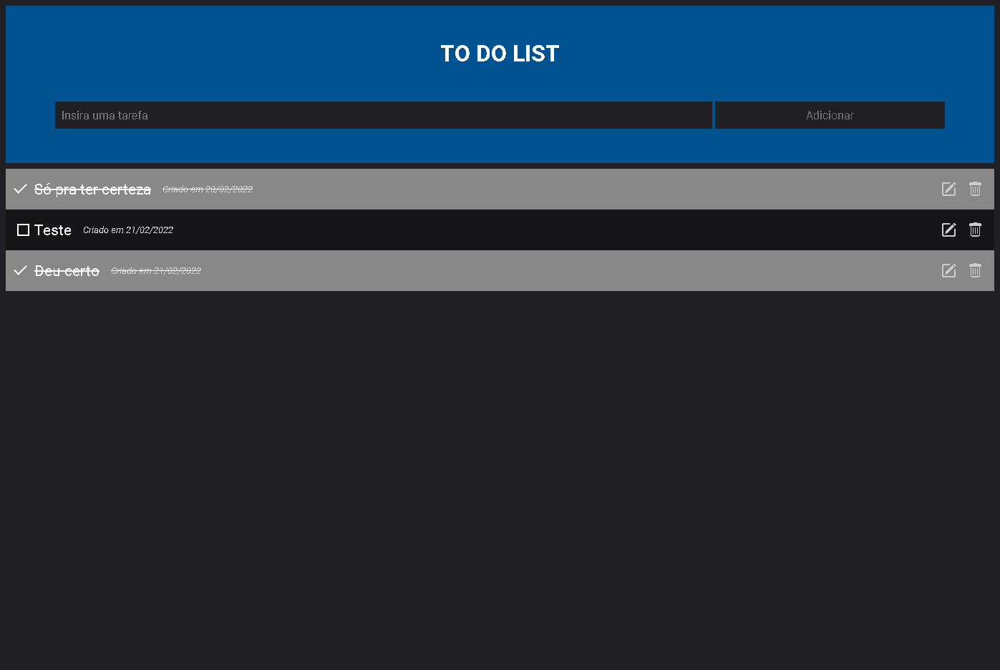

# Desafio Mentoria - TO DO LIST

Atráves de uma mentoria, recebi o desafio de fazer uma TO DO LIST. A ajuda para realizar a tarefa veio pelo canal no Youtube do [Thi Code](https://www.youtube.com/channel/UCnATHGHftSGHbhn6uF8dEUA).

Didatica incrível e me ajudou a entender um pouquinho mais do JS para backend.

## 🛠️ Construído com

* NodeJS 
* Express
* EJS
* MongoDB 

## ✒️ Autora

⌨️ com ❤️ por [becardine](linkedin.com/in/becardine/) através do canal do [Thi Code](https://github.com/codethi)

## 🎁 Expressões de gratidão

* Se você chegou até aqui, muito obrigada 📢
